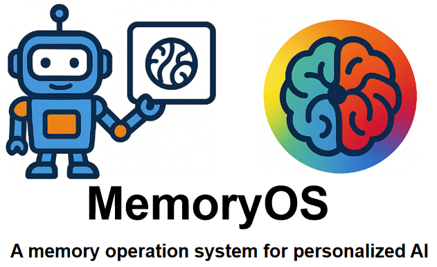

# MemoryOS
<div align="center">
  
</div>
<p align="center">
  <a href="./Paper-MemoryOS.pdf">
    
  </a>
  <a href="./Wechat.png">
    
  </a>
  <a href="https://youtu.be/y9Igs0FnX_M" target="blank">
    
  </a>
    <a href="https://www.apache.org/licenses/LICENSE-2.0" target="_blank">
    
  </a>
</p>

**MemoryOS** is designed to provide a memory operating system for personalized AI agents, enabling more coherent, personalized, and context-aware interactions. Drawing inspiration from memory management principles in operating systems, it adopts a hierarchical storage architecture with four core modules: Storage, Updating, Retrieval, and Generation, to achieve comprehensive and efficient memory management. On the LoCoMo benchmark, the model achieved average improvements of **49.11%** and **46.18%** in F1 and BLEU-1 scores.

## Demo
[](https://youtu.be/y9Igs0FnX_M)


## Latest News

*   **[2025-05-30]**: Initial version of MemoryOS launched! Featuring short-term, mid-term, and long-term persona Memory with automated user profile and knowledge updating.
## 	System Architecture


## Project Structure

```
memoryos/
├── __init__.py            # Initializes the MemoryOS package
├── __pycache__/           # Python cache directory (auto-generated)
├── long_term.py           # Manages long-term persona memory (user profile, knowledge)
├── memoryos.py            # Main class for MemoryOS, orchestrating all components
├── mid_term.py            # Manages mid-term memory, consolidating short-term interactions
├── prompts.py             # Contains prompts used for LLM interactions (e.g., summarization, analysis)
├── retriever.py           # Retrieves relevant information from all memory layers
├── short_term.py          # Manages short-term memory for recent interactions
├── updater.py             # Processes memory updates, including promoting information between layers
└── utils.py               # Utility functions used across the library
```

## How It Works

1.  **Initialization:** `Memoryos` is initialized with user and assistant IDs, API keys, data storage paths, and various capacity/threshold settings. It sets up dedicated storage for each user and assistant.
2.  **Adding Memories:** User inputs and agent responses are added as QA pairs. These are initially stored in short-term memory.
3.  **Short-Term to Mid-Term Processing:** When short-term memory is full, the `Updater` module processes these interactions, consolidating them into meaningful segments and storing them in mid-term memory.
4.  **Mid-Term Analysis & LPM Updates:** Mid-term memory segments accumulate "heat" based on factors like visit frequency and interaction length. When a segment's heat exceeds a threshold, its content is analyzed:
    *   User profile insights are extracted and used to update the long-term user profile.
    *   Specific user facts are added to the user's long-term knowledge.
    *   Relevant information for the assistant is added to the assistant's long-term knowledge base.
5.  **Response Generation:** When a user query is received:
    *   The `Retriever` module fetches relevant context from short-term history, mid-term memory segments, the user's profile & knowledge, and the assistant's knowledge base.
    *   This comprehensive context is then used, along with the user's query, to generate a coherent and informed response via an LLM.

## Getting Started

### Prerequisites

*   Python >= 3.10
*   pip install -i https://pypi.org/simple/ MemoryOS-BaiJia

### Installation

```bash
conda create -n MemoryOS python=3.10
conda activate MemoryOS
pip install -i https://pypi.org/simple/ MemoryOS-BaiJia
```

### Basic Usage

```python

import os
from memoryos import Memoryos

# --- Basic Configuration ---
USER_ID = "demo_user"
ASSISTANT_ID = "demo_assistant"
API_KEY = "YOUR_OPENAI_API_KEY"  # Replace with your key
BASE_URL = ""  # Optional: if using a custom OpenAI endpoint
DATA_STORAGE_PATH = "./simple_demo_data"
LLM_MODEL = "gpt-4o-mini"

def simple_demo():
    print("MemoryOS Simple Demo")
    
    # 1. Initialize MemoryOS
    print("Initializing MemoryOS...")
    try:
        memo = Memoryos(
            user_id=USER_ID,
            openai_api_key=API_KEY,
            openai_base_url=BASE_URL,
            data_storage_path=DATA_STORAGE_PATH,
            llm_model=LLM_MODEL,
            assistant_id=ASSISTANT_ID,
            short_term_capacity=7,  
            mid_term_heat_threshold=5,  
            retrieval_queue_capacity=7,
            long_term_knowledge_capacity=100
        )
        print("MemoryOS initialized successfully!\n")
    except Exception as e:
        print(f"Error: {e}")
        return

    # 2. Add some basic memories
    print("Adding some memories...")
    
    memo.add_memory(
        user_input="Hi! I'm Tom, I work as a data scientist in San Francisco.",
        agent_response="Hello Tom! Nice to meet you. Data science is such an exciting field. What kind of data do you work with?"
    )
     
    test_query = "What do you remember about my job?"
    print(f"User: {test_query}")
    
    response = memo.get_response(
        query=test_query,
    )
    
    print(f"Assistant: {response}")

if __name__ == "__main__":
    simple_demo()
```


## Contributing

Contributions are welcome! Please feel free to submit issues or pull requests.

## Citation

If you find this project useful, please consider citing our paper:

```bibtex
```
## Contact us
百家AI是北京邮电大学白婷副教授指导的研究小组, 致力于为硅基人类打造情感饱满、记忆超凡的大脑。
合作与建议：baiting@bupt.edu.cn


